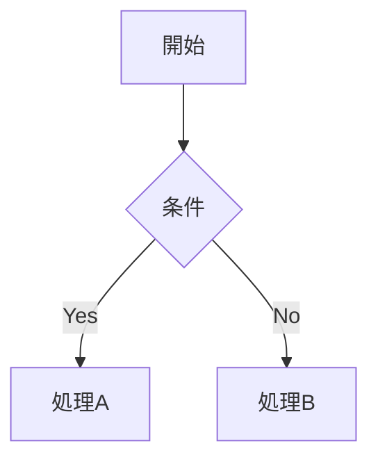

# Mermaid Diagram Generator

Mermaid記法でダイアグラムを生成し、SVG/PNGに出力する。

## 前提条件

mmdc（Mermaid CLI）が必要。未インストールの場合は自動インストールを提案する。

```bash
# インストール確認
npx mmdc --version

# 未インストールの場合
npm install -g @mermaid-js/mermaid-cli
```

## 実行フロー

### Step 1: 図の種類を判定

ユーザーの入力 `$ARGUMENTS` から図の種類を判定:

| キーワード | 図の種類 | Mermaid構文 |
|-----------|---------|------------|
| フローチャート、ワークフロー、処理フロー | フローチャート | `graph TD` or `graph LR` |
| シーケンス、API連携、通信フロー | シーケンス図 | `sequenceDiagram` |
| ER図、テーブル関係、DB設計 | ER図 | `erDiagram` |
| ガント、スケジュール、タイムライン | ガントチャート | `gantt` |
| クラス、オブジェクト、継承 | クラス図 | `classDiagram` |
| 状態、ステータス遷移 | 状態遷移図 | `stateDiagram-v2` |
| マインドマップ、整理、ブレスト | マインドマップ | `mindmap` |
| 円グラフ、比率、割合 | 円グラフ | `pie` |

### Step 2: Mermaid記法でコード生成

`.mmd` ファイルとして書き出す:

```bash
# 出力先
output/diagrams/{name}.mmd
```

### Step 3: SVG/PNG変換

```bash
# SVG出力（推奨・高品質）
npx mmdc -i output/diagrams/{name}.mmd -o output/diagrams/{name}.svg -t dark

# PNG出力（画像として使いたい場合）
npx mmdc -i output/diagrams/{name}.mmd -o output/diagrams/{name}.png -t dark -w 1920 -H 1080

# テーマオプション: default, dark, forest, neutral
```

### Step 4: 結果報告

- 生成したファイルパスを報告
- Markdownプレビュー用のコードブロックも表示
- GitHubのREADMEに埋め込む場合のコード例を提示

## テーマ一覧

| テーマ名 | 特徴 |
|---------|------|
| `default` | 明るい標準テーマ |
| `dark` | ダークモード |
| `forest` | 緑系の落ち着いたテーマ |
| `neutral` | グレー系のニュートラル |

## 出力ディレクトリ

```
output/diagrams/
├── {name}.mmd     # Mermaidソース
├── {name}.svg     # SVG出力
└── {name}.png     # PNG出力（オプション）
```

## 対応する図の種類

1. **フローチャート** (graph TD/LR/BT/RL)
2. **シーケンス図** (sequenceDiagram)
3. **クラス図** (classDiagram)
4. **状態遷移図** (stateDiagram-v2)
5. **ER図** (erDiagram)
6. **ガントチャート** (gantt)
7. **円グラフ** (pie)
8. **マインドマップ** (mindmap)
9. **タイムライン** (timeline)
10. **ジャーニーマップ** (journey)

## Markdown埋め込み

GitHub/VS Codeで直接プレビューできる形式:

````markdown

````
