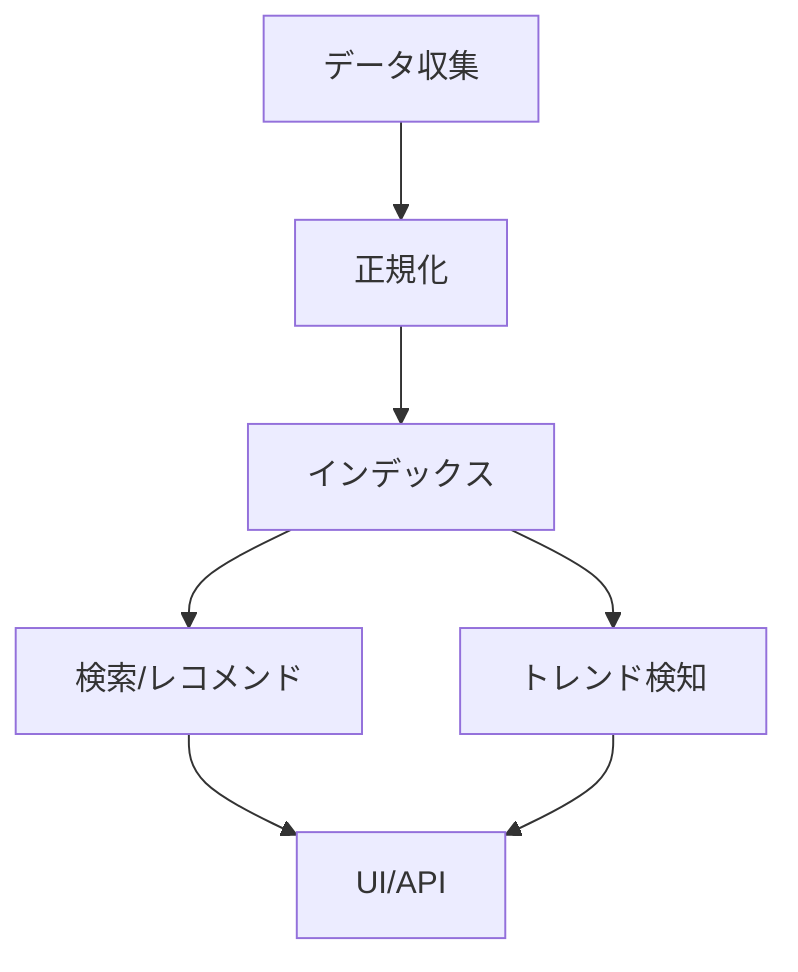

# 成果物テンプレート・スキーマ

## MASTER_PROPOSAL.md テンプレート

```markdown
# [テーマ] システム構築提案書

**作成日**: YYYY-MM-DD
**調査期間**: YYYY-MM-DD 〜 YYYY-MM-DD
**対象リポジトリ**: [パスまたはURL]

---

## 1. Executive Summary

### 狙い
- [1-2文で目的を記述]

### 提供価値
- [ユーザーにとっての具体的なメリット 3-5点]

### 差別化
- [競合/既存ソリューションとの差別化ポイント]

---

## 2. 市場地図

### Skills/MCPマーケット概況
| マーケット | 規模 | 成長率 | 主要プレイヤー | 出典 |
|-----------|------|--------|--------------|------|

### APIマーケット概況
| プラットフォーム | API数 | カテゴリ | 差別化 | 出典 |
|----------------|-------|---------|--------|------|

### 拡張機能マーケット概況
| ストア | 拡張数 | 主要カテゴリ | 更新頻度 | 出典 |
|--------|--------|------------|---------|------|

---

## 3. Keyword Universe

### トップキーワード（上位20件）
| # | キーワード | 分類 | 根拠 | 代理指標 |
|---|----------|------|------|---------|

### 急上昇キーワード
| キーワード | 指標 | 期間 | ソース |
|-----------|------|------|--------|

### ニッチキーワード
| キーワード | 専門領域 | 競合度 | 潜在価値 | ソース |
|-----------|---------|--------|---------|--------|

---

## 4. データ取得戦略

### ソース別取得方法
| ソース | 方法 | API有無 | レート制限 | 規約制約 | 更新検知 |
|--------|------|---------|----------|---------|---------|

### 更新検知パイプライン
[更新をどう検知し、データを最新に保つかの設計]

### 規約順守チェックリスト
- [ ] robots.txt確認済み
- [ ] API利用規約確認済み
- [ ] レート制限設定済み
- [ ] PII除外ルール設定済み

---

## 5. 正規化データモデル

### 統一スキーマ
```yaml
Entity:
  id: string (UUID)
  type: enum [skill, tool, mcp, extension, api_package]
  name: string
  description: string
  source: string (URL)
  source_market: string
  category: string[]
  tags: string[]
  author: string
  license: string
  version: string
  created_at: datetime
  updated_at: datetime
  metrics:
    stars: number
    downloads: number
    rating: number
    review_count: number
  dependencies: string[]
  compatibility: string[]
  status: enum [active, deprecated, archived]
```

### リレーション
[エンティティ間の関係図]

---

## 6. トレンド検知アルゴリズム

### 代理指標
| 指標 | ソース | 計算方法 | 更新頻度 |
|------|--------|---------|---------|

### 評価指標（スコアリング）
[各ツール/スキルのランキング算出方法]

### トレンドシグナル
[急上昇/下降の検知ロジック]

---

## 7. システムアーキテクチャ

### アーキテクチャ図


### コンポーネント責務
| コンポーネント | 責務 | 技術選定 | 理由 |
|--------------|------|---------|------|

---

## 8. 実装計画

### MVP（Phase 1: X週間）
- [ ] [タスク1]
- [ ] [タスク2]

### 拡張（Phase 2: X週間）
- [ ] [タスク1]
- [ ] [タスク2]

### リポジトリ変更案
| 変更 | ファイル/ディレクトリ | 内容 |
|------|-------------------|------|

### タスク分解
| # | タスク | 優先度 | 依存 | 工数目安 |
|---|--------|--------|------|---------|

---

## 9. セキュリティ/法務/運用

### 監査ログ
[何をログに残すか]

### PII対応
[個人情報の扱い方針]

### レート制限
| 外部API | 制限 | 対策 |
|---------|------|------|

### SLA
[可用性/パフォーマンス目標]

---

## 10. リスクと代替案

| # | リスク | 影響度 | 発生確率 | 対策/代替案 |
|---|--------|--------|---------|-----------|

### 取得不能ソース時の設計
[特定ソースが使えなくなった場合のフォールバック]

---

## 11. 意思決定ポイント（Go/No-Go）

| # | 判断項目 | 選択肢 | 推奨 | 判断に必要な情報 |
|---|---------|--------|------|----------------|

### 次のアクション
- [ ] [ユーザーが判断すべき項目1]
- [ ] [ユーザーが判断すべき項目2]
- [ ] [ユーザーが判断すべき項目3]

---

## 出典一覧

| # | タイトル | URL | 確認日 |
|---|---------|-----|--------|
```

## keyword_universe.csv スキーマ

```csv
keyword,lang,type,rationale,sources,metrics_proxy
"MCP server","en","related","Model Context Protocolの中核概念","https://...","GitHub stars: 1.2k"
```

| 列 | 型 | 説明 |
|----|-----|------|
| keyword | string | キーワード |
| lang | string | 言語（en/ja/etc） |
| type | enum | related, compound, rising, niche |
| rationale | string | 選定理由 |
| sources | string | 出典URL（複数はセミコロン区切り） |
| metrics_proxy | string | 代理指標（stars数、投稿数等） |

## taxonomy.yaml スキーマ

```yaml
taxonomy:
  - category: "AI Agent Frameworks"
    subcategories:
      - name: "MCP Servers"
        keywords: ["mcp", "model-context-protocol", ...]
      - name: "Skill Systems"
        keywords: ["claude-skills", "skill-marketplace", ...]
  - category: "API Marketplaces"
    subcategories:
      - name: "REST APIs"
        keywords: [...]
```

## research/ 成果物フォーマット

全リサーチ成果物は以下のヘッダーで始める:

```markdown
# [タイトル]

**更新日**: YYYY-MM-DD
**フェーズ**: Phase X
**ステータス**: Draft / Final

---
```

主張には必ず出典を付記:

```markdown
MCPサーバーの登録数は2026年3月時点で5,000を超えている。
**出典**: [MCP.so](https://mcp.so/) (確認日: 2026-03-11)
```
